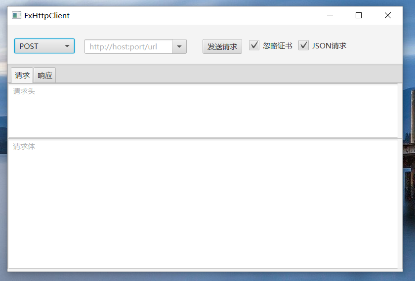

# fx-dev-tools
用javaFX实现的简单常用小工具，如http客户端,连通性测试工具,端口和主机扫描工具等.

## 开发环境
- jdk13 (模块化构建以及http client)
- openjfx13(javaFX)
- gradle6.0

## 目的
- 学习javaFX
- 体验Java9引入的模块化系统
- 体验jdk原生http client
- 体验jlink与定制jre

## 前置条件
- 至少使用jdk11, api中使用了Java11中的http client,现已稳定,不兼容jdk9和jdk10,http client模块及包不同
- 需要单独安装javafx运行环境(后续会打包定制的运行环境,包括jre和javaFX运行环境)
- gradle6.0  
`注意: 下载运行此项目必须满足上面的条件,开发环境jdk必须要配置为java11+`

## TODO
- 目前只有界面,逻辑未实现
- jlink定制jre
- 运行环境打包
- 引入嵌入式数据库保存历史记录

## 笔记
[笔记, 包含javaFX常见问题以及开发过程中遇到的其他问题](note/note.md)

## 效果

1. 主界面

